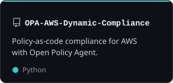
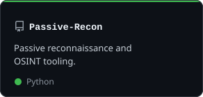
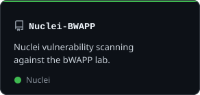

  <picture>
    <source media="(prefers-color-scheme: dark)" srcset="./assets/overview-dark.svg" />
    <source media="(prefers-color-scheme: light)" srcset="./assets/overview-light.svg" />
    
  </picture>

  
  

### About me

I work at the point where hands-on security meets assurance. I test and review cloud and network
environments, then turn the findings into controls and risk insight that teams can act on.
Most of my work is in the UAE, Saudi Arabia and India.

- 🔭 **Now:** Consultant III, Technology Audit @ Protiviti, doing cloud architecture and security reviews
- 🛡️ **Focus:** cloud security · VAPT · red teaming · GRC (ISO 27001, NIST 800-53, CSA CCM, UAE IA)
- 📄 **Published:** *AWS Cloud Compliance Automation with Open Policy Agent*, IEEE 2024
- 🎓 **Certified:** eJPT · INE Certified Cloud Associate · ISC2 CC · Aviatrix ACE

### Featured

  <a href="https://github.com/alenpaul36/OPA-AWS-Dynamic-Compliance"><picture><source media="(prefers-color-scheme: dark)" srcset="./assets/repo-opa-aws-dark.svg" /><source media="(prefers-color-scheme: light)" srcset="./assets/repo-opa-aws-light.svg" /></picture></a>
  <a href="https://github.com/alenpaul36/Passive-Recon"><picture><source media="(prefers-color-scheme: dark)" srcset="./assets/repo-passive-recon-dark.svg" /><source media="(prefers-color-scheme: light)" srcset="./assets/repo-passive-recon-light.svg" /></picture></a>
  <a href="https://github.com/alenpaul36/Nuclei-BWAPP"><picture><source media="(prefers-color-scheme: dark)" srcset="./assets/repo-nuclei-bwapp-dark.svg" /><source media="(prefers-color-scheme: light)" srcset="./assets/repo-nuclei-bwapp-light.svg" /></picture></a>

### Toolbox

  

