<p align="center">
  
</p>

<p align="center">
  
  
  
</p>

### `alen@kali:~$ cat about.md`

> Cybersecurity consultant delivering technology-risk and security-assurance engagements across
> **India and the Middle East**. I work on both sides of the keyboard: hands-on **cloud security,
> penetration testing and adversary simulation**, and advisory work on **control design, regulatory
> compliance and IT general controls**. I turn technical findings into risk-aligned, audit-ready
> insight that both engineers and executives can act on.

### `alen@kali:~$ tail experience.log`

```yaml
- role:  Consultant III · Technology Audit
  org:   Protiviti
  when:  Jan 2026 → present
  where: Abu Dhabi, UAE
  log:
    - Cloud architecture & security reviews for an enterprise AI & cloud provider (IaaS/PaaS/SaaS)
    - Benchmarked sovereign & multi-tenant services against CIS, CSA CCM and UAE IA
    - Built a Unified Control Framework → 20 standards · 34 control domains · 345 sub-domains
    - Gap assessments vs UAE IA, DESC ISR, ISO 27001, CSA CCM; data-center physical security reviews

- role:  Consultant II · Technology Audit
  org:   Protiviti
  when:  Sep 2024 → Jan 2026
  where: India & Saudi Arabia
  log:
    - End-to-end VAPT across internal / external networks, systems and applications
    - Red team & threat-intel-led engagements with MITRE ATT&CK attack scenarios
    - Firewall, router, VPN and wireless audits (FortiGate, Cisco) against CIS & NIST baselines
    - Secure configuration reviews of servers, databases, AWS and Azure; ITGC assessments
  award: Accelerator Award — exceptional client delivery
```

### `alen@kali:~$ nmap -sV alen.local`

```text
Starting Nmap 7.95 ( https://nmap.org )
Nmap scan report for alen.local
PORT      STATE  SERVICE          VERSION
443/tcp   open   cloud-security   AWS, Azure, Prowler, ScoutSuite, Open Policy Agent, IaC, cloud CLIs
80/tcp    open   web-vapt         Burp Suite, Nikto, DirBuster, ProjectDiscovery, Google dorking
445/tcp   open   red-team         MITRE ATT&CK, AD exploitation, Metasploit, OSINT, SpiderFoot, CTI
161/udp   open   network-audit    FortiGate, Cisco, VPN, wireless, Nipper Studio, Nessus, Wireshark
8443/tcp  open   grc              ISO 27001/27017/27018/42001/20000, NIST 800-53, SOC 2,
                                  CSA CCM, UAE IA, DESC ISR, CIS Benchmarks
22/tcp    open   scripting        Python, Bash

Service detection performed. 6 services up, all of them hardened.
```

<p align="center">
  
</p>

### `alen@kali:~$ ls -l ~/certs`

```text
total 4
-r--r--r--  1 alen  INE       Jul 2025  eJPT_junior_penetration_tester
-r--r--r--  1 alen  INE       Jun 2025  certified_cloud_associate
-r--r--r--  1 alen  Aviatrix  Jul 2024  ace_multi_cloud_network_associate
-r--r--r--  1 alen  ISC2      Jun 2024  certified_in_cybersecurity_cc
```

### `alen@kali:~$ cat research/*`

```diff
+ [IEEE · 2024] Amazon Web Services Cloud Compliance Automation with Open Policy Agent
  DevSecOps pipeline that embeds OPA in CI/CD to validate AWS CloudFormation templates
  and block non-compliant infrastructure-as-code before it is deployed.

+ [Project · 2024] Cloud Governance & Compliance with Open Policy Agent on AWS
  OPA + AWS Config via Lambda evaluates live resources against custom Rego policies;
  Systems Manager runbooks auto-remediate; Glue + Athena + QuickSight compliance dashboard.
```

### `alen@kali:~$ cat ~/education`

```text
B.Tech, Computer Science Engineering with Cyber Security
Amrita Vishwa Vidyapeetham, Chennai · 2020 – 2024
coursework: cloud security, VAPT, networking, secure systems engineering
```

### `alen@kali:~$ git log --graph --stat`

<p align="center">
  <picture>
    <source media="(prefers-color-scheme: dark)" srcset="https://raw.githubusercontent.com/alenpaul36/alenpaul36/output/profile-night-rainbow.svg" />
    <source media="(prefers-color-scheme: light)" srcset="https://raw.githubusercontent.com/alenpaul36/alenpaul36/output/profile-green-animate.svg" />
    
  </picture>
</p>

<p align="center">
  
  
</p>

### `alen@kali:~$ ./connect.sh`

<p align="left">
  <a href="https://www.linkedin.com/in/alen-paul2201"></a>
  <a href="mailto:alenpaul36@gmail.com"></a>
  <a href="https://github.com/alenpaul36"></a>
</p>

```text
alen@kali:~$ exit
logout. Thanks for stopping by. Connection to alen.local closed.
```

<!--
3D graph: generated by .github/workflows/profile-3d.yml (daily, on push to main, or Actions → "3D Github contributions" → Run workflow)
and published to the `output` branch.
-->
